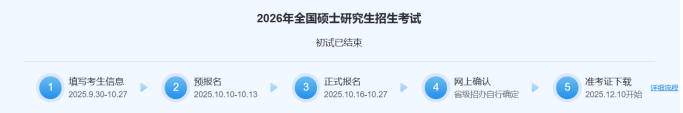
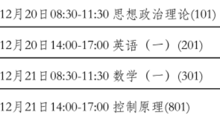
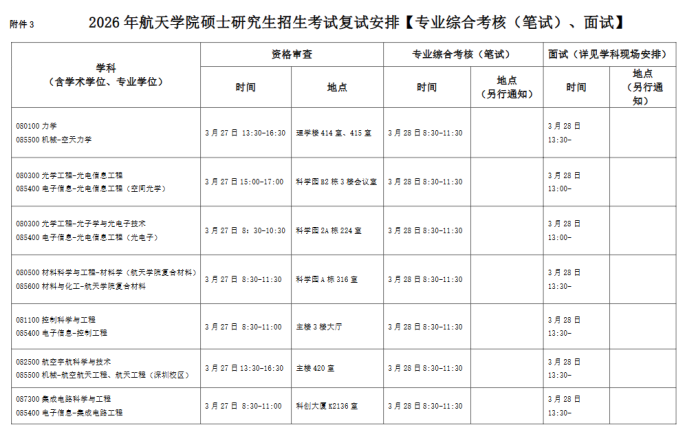

本人为 22 届自动化的学生，刚参加完 26 年考研，OpenAuto 这块儿缺了考研方面的资料，本人就分享一下关于考研的一些建议，希望对大家有帮助。

## 备考前

首先想好自己要不要考研。对我这种擦线进复试、在缩招背景下大概率没个好学位的应届生来说，考完心里就在咒骂感觉大三暑假不如出去找实习提升自己——虽然这都是后话了，但还是建议明确考研目的，权衡自己能投入多少，不然备考期间三天打鱼两天晒网，可能还真不如提升自己的技能来的实在。

顺带讲讲 26 年考研的形势。由于数一比往年简单，各学校的复试线基本上涨，哈工大这边相比去年各科基本都是缩招—— 25 年控制工程复试 249 人，招 172 人，25 年复试 177 人，招 117 人，复录比基本维持在 150% 左右，但是复试人数少近 30%，结果导致复试资格线比 25 年涨了 60 分，骇死人了。27 年考研形势我不好说，多找老师打听打听，说不定今年太狠明年就松一点。

## 考研的大致流程

### 报名

报名要用到网站 [https://yz.chsi.com.cn/yzwb/](https://yz.chsi.com.cn/yzwb/)，可以在上面的硕士目录里面查报的校区计划招多少人，下面是 26 年报名过程的时间，可以参考一下。

以上这些在规定时间内完成就行，要特别注意的是准考证下载这一环节，因为会公布考点，建议当天蹲点，查一下往年该考点从哪个门进，赶紧订酒店，住的地方离考场越近越好，至少订两个晚上。

### 初试

初试时间安排参考如下。

专业课的试卷比较特殊，要装到信封里面，最后可能要预留时间封信封。考完当天地铁会特别挤，我当时差点排到地上去了，不喜欢排队的建议提前做好准备冲地铁或者打车。

### 复试

初试结果大概 2 月底出，26 年的是在 2 月 28 号，在考研报名的网站上查询即可，另外哈工大的初试是不会公布排名的，问招生办的老师也不会告诉你，只会让你等复试线。国家线一般不用看，初试出分不久后出，过国家线对考哈工深的来说没什么问题吧；26 年的哈工大复试基本线 3 月 13 号出，这个可以在本部网站的研究生招生里面直接找到（[https://yzb.hit.edu.cn/8822/list.htm](https://yzb.hit.edu.cn/8822/list.htm)）；最需要关注的是复试资格线，这个出来特别晚，26 年的 3 月 21 号才出，建议复试基本线出来后时不时查一下对应院校网站的通知消息区（[http://sa.hit.edu.cn/tzgg_6582/list.htm](http://sa.hit.edu.cn/tzgg_6582/list.htm)），过了复试资格线意味着要去复试了——正常情况都是去本部复试，我记得就港澳台考生以及低空技术与工程是在深圳复试。复试资格线出来同时会出录取工作方案，关键的信息还包括进复试的人数和计划录取人数、复试资格审查材料说明、复试安排，顺便可以去同一时间公布的复试名单里面看看自己在报的校区里面排名是多少，掂量一下第一志愿上岸难度，太难了就多花点时间考虑调剂的事情，可以找辅导员或者比较懂的老师咨询这方面。复试安排参考如下。

酒店一般订在正门附近，面试完当天就回去时间比较赶，建议面试完第二天再走。

> 搭乘飞机的注意事项
>
> 正常情况下是从深圳宝安机场到哈尔滨太平机场，从学校打车建议至少提前两个小时出发，到机场时最好离起飞预留一个半小时左右的时间。我是在 12306 上订的机票，进机场先去找自助机打印机票，如果要托运行李，去对应分区出示机票和身份证即可，接下来便可以去安检。打火机，无 3C 标识的充电宝以及水不能带，电脑建议单独分开装，这样方便些。安检完找到对应登机口即可。另外，衣服不用准备太多，哈尔滨不下雨的情况下，深圳最冷时的穿着足够用了——当然，还是要看天气怎么样，我那会儿两天都是晴天；身体不好的同学记得带口罩过去，那边可能起霾。

过去要带的打印材料包括身份证、教育部学籍在线验证报告（学信网个人主页上下载，一般都是过期的，建议自行延长到 6 月 30 号之后）、初试准考证、成绩单（T3 可刷校园卡的打印机打印）、参加过的比赛的一些证书或者奖学金证书之类的以及个人简历（花点时间做好看点，我的特别糙），诚信复试承诺书可以不打印，资格审查那边一般会有。记得带计算器，我的忘带了，到哈尔滨后现场下单买的。

资格审查在规定时间段内完成就好了，审查完会给你发带笔试面试地点的复试安排表，可以提前去看考场在哪里，另外，考场所在教学楼里开的小卖部在笔试面试当天会关门，不要像我一样以为能在那边解决早餐结果灰头灰脸饿着肚子去考试。

笔试早点去，找自己所在的考场，记得带身份证、初试准考证、计算器。考完了会有填志愿表的环节，跟校内调剂直接关系。

面试会有一个房间专门存放物品，可以带纸质资料和笔去抽签，然后在候考室等老师的安排。面试的形式不知道每年是不是一样的，26 年的是四个人一组，同时进一间教室，老师坐在教室四个角，对应四个环节：控制理论、控制实践、外语、综合。四个人同时进行面试，每个环节进行五分钟强制结束，然后顺时针去进行下一个环节。综合环节要提交简历，最好把证书之类的也给老师看。面试完就可以润了，下午可能会有关于调剂的宣讲会，自行决定要不要去。考完试后面几天保持电话通讯正常，因为可能有老师打电话问你调剂的事情。

## 备考建议

### 数学一

数一建议最早开始。我主要是买资料书，先回顾知识再刷题，刷到一定程度后做真题，每一年真题最好预留 3 个小时的答题时间。赶进度的话真题可以从 1997 的真题开始刷，再赶时间那就刷近十年的真题，错题的知识点记得及时总结，刷真题前先看看自己易错知识点。网上可能会讲一些比较小众的解题方法或者比较偏门的题目，这东西我不好评价，毕竟我只是浅尝辄止且没有因此获益，感觉回报率不高，建议不要花太多时间精力在这上面。根据做真题的经验，偶数年的题会比较难，今年属于是反其道而行之了，但不管怎么样，27 年总不会像这次这么简单吧。

### 英语一

英一重点是积累，我个人一直秉持着“只要能贯通全文，非作文题就非常简单”的思想，如果词汇量够多阅读题和完形填空基本就 pass 了；作文除了背模板，建议多积累一些连接词和连接短语，既能水字数还能润滑写作思路。我个人是暑假开始每天背一点红皮书，过完一轮后第二轮背第一轮不太熟的词，如此反复；作文会摘抄资料书里面比较好的长难句，写作文套进去就行了。另外作文模板准备齐全一点，我没怎么背图表类的导致作文写的不是很好。总结下来英语不需要每天很多时间，重点是坚持积累。

### 思想政治

思政我只考了 69，主要说说我遇到的坑。除了大学的五门思政课——马原、毛概、习思想、近代史和思修，思政考研还涉及时政。思政不用很早就准备，暑假后半才开始也可以。听课感觉没什么用，感觉不如直接刷题——我买了徐涛老师的课程，虽然他讲的比较有意思，但是做题的时候讲了什么想不起多少，不过选择题答题技巧跟时政可以听听，选择题说一千道一万，刷题远比看书听课有效，错了才知道哪里不懂。多选题比较坑，多选少选都不给分，建议多花点时间在上面。考纲出来后各大考研机构一般会发分析题模板，这个很重要，我那会儿一共是 25 个模板，考试的时候其实大差不差，模板基本涵盖了考题内容，只要结合具体题目分析再套模板基本没啥问题，不过由于我背的有点晚了，所以分析题答得不怎么样，大背诵这种东西建议大家多留点时间。

### 专业课

专业课考的是自动控制原理的内容，所以大三下学期的自控原理 B 要认真学。我是大四开学才开始准备，感觉时间有点紧迫，建议最晚暑假开始就准备。资料去淘宝上搜索你报的专业代码就行，买的时候问问真题以及参考答案的时间范围，我买的少了 25 年真题答案。题型全是大题，没记错的话是 10 道，一道 15 分，建议先回归书本，多看看上课的 PPT，考题会有一定深度，但是题型不会整什么新花样，后期把真题做一遍大抵就没什么问题了。专业课初试是不能带计算器的。

### 复试笔试

复试的资料也是跟初试专业课一样在淘宝找就行，重点是笔试，考察范围分 5 个方面——电路、模电、数电、控制元件、控制系统设计，一共 10 题，一题 20 分，考题深度为简单到适中，不会考察很难，参考书目会在硕士研究生招生复试参考里面给出（航天学院官网上有，一般初试完就有了）。电路、数电模电和控制元件复习往年重点一般没啥问题，不过听说 25 年考了个比较偏的二端口，有余力还是看看重点之外的内容；控制原理必须回归书本，要仔细阅读跟考察内容有关的章节，书上的课后题也要知道答案，我笔试就空了一道题，关于伺服系统和调节系统的不同，之前感觉调节系统不怎么考就没太当回事儿。记得带计算器。

### 面试

面试列过四环节了，不再赘述。

综合要给老师看简历，最好展示证书之类的，老师会问你大学的比赛经历，建议预先包装一下自己在比赛里面的工作，至少听起来专业正规一点，可以讲讲做的项目用了哪些专业知识，最好是课外的，体现你有课外学习的能力，比如说我讲做平衡车用到了卡尔曼滤波。

外语的环节疑似不固定，之前问学长，学长说有自我介绍、专业术语汉译英、专业论文片段英译汉，我这边只有专业论文片段英译汉和英语提问，翻译主要就是注意语序，一些专业术语会标汉语，不过打印可能出问题，我翻译的片段就把for 和 a 打到一起，第一眼看到 fora 还以为是什么没标的专业术语，翻译尽量快一点，不然挤占提问时间可能导致后面紧张；提问不清楚会考哪些，建议练习口语到比较流利为止，我的问题跟专业无关，想好内容再开口，不然答得结结巴巴的；虽然没考察，但还是建议提前准备个 1 分钟左右的英语自我介绍，有时间再看看控制相关的英文词汇。

控制理论跟控制实践都是老师抽一个问题让你回答，我的是关于前馈跟伺服电机的，两个都不熟，只能说拉完了，我看也有不少人在前馈那里栽坑，毕竟学的主要是反馈，前馈讲的确实不多，建议备考这方面多回归书本。另外老师应该知道考生来源，我第四个环节的一个老师当时冷不丁说了一句我是深圳校区的学生，所以不用太紧张，遇到不会的可以让老师给点提示，实在答不上来厚着脸皮复述老师的提示内容。

三个环节里面，初试跟复试笔试是最重要的，面试的话拉不开太大差距，希望分清楚主次。

## 关于调剂

如果分数没到复试资格线或者擦线进去，继续学业意愿比较大的同学建议早点去找研究所调剂。研究所一般都会在研招网开放调剂之前就提前面试确定好名单，我被辅导员告知没考上那会儿，上海航天技术研究所都已经招第二轮面试了，等 4 月 8 号研招网开放调剂，我找的 803 所、805 所、八院都是很快打电话告知我人招的差不多了。另外也别对未来工学部抱什么期望，当初招 300 人，进面试只有 99 人，看着没什么人去读，实际上 4 月 8 号调剂的时候初试擦线过别人都不一定看得上——当时控制工程最低分数是 398，比 395 还高。未来工学部还可能有第二次调剂，但是难度极大，原本计划 20 录 3，实际上 18 录 4，被录取也是相当困难。要调剂就尽早打算，个人建议最迟也得是去本部复试完就准备，最好打电话直接联系，顺便发邮件投简历，如果是复试资格线都没进，出复试资格线的时候就可以做准备了。个人评价，如果你是清明假后取得联系，那就太晚了，清明假期间招生办都不上班的，打电话没人接，而且假后不久就是研招网开放调剂。

还有就是，如果对自己能力没底求稳的话，在最开始报名的时候就建议报研究基地，好像苏州基地是招控制工程最多的（这句话李建刚老师当初就对我说过，显然我没当一回事，已后悔）。如果基地都没底，那直接报未来工得了。顺便讲讲找工作的部分。自动化本科找工作感觉就是一坨，很多岗位卡硕士学历，追求稳定的建议早点转型，比如转硬件或者软件——实在下定不了决心考研的，干脆就别考了，大三暑假找点好的实习，经历对找工作是加分项。另外找工作最好是专业对口，如果你是应届生身份去找工作，那 HR 对你的要求会相对松一点；但如果你找不对口的专业，未来某天失业了再找工作那对你的工作经验就有一定要求了。另外可以关注 3 月份的春招，哪些企业来哈工深校招，这些企业一般对哈工深认可度比较高，被录取概率会大一点——认可度不高的企业不仅要求高，开的工资也低，我之前面一个硬件岗，月薪最低才 7k，我还以为要求不高，结果面试的时候对面嫌我设计 PCB 经验太少了，很不留情面地说感觉我不适合他们的岗位，我没意见。

面试方面，提前了解企业是干什么的是必须的。形式方面，最常见的就是自我介绍后 HR 直接问你各种问题；也有一些是让面试人员一起讨论问题，看过程中的表现录取。部分面试前可能会让你做一套笔试题，这类最麻烦了，也是自动化人最讨厌的，因为考硬件的时候就会问一些电气之内，自动化之外的问题，泛而不精这一块，我没意见。如果 HR 问你有什么问题，建议问清楚待遇能达到多少，休假情况，加班情况以及五险一金之类的，期望月薪就说比 1w 稍微低一点。

BTW，找工作时最好说自己没有二战意愿，还有就是了解一下三方协议，被录取后要填这个，一般领毕业证前填完就行，具体内容参考网站 [https://job.hitsz.edu.cn/zhxy-szxszyfzpt/tzgg/tzggxq?id=OGMxNTA3YWYwNTZhNGJmMGI4ZDcwOWE1Nzc2M2ExMGE-](https://job.hitsz.edu.cn/zhxy-szxszyfzpt/tzgg/tzggxq?id=OGMxNTA3YWYwNTZhNGJmMGI4ZDcwOWE1Nzc2M2ExMGE-) 中的电子就业协议。

## 关于毕设

大三下结束就可以找导师，越早越好，一般女老师都比较宽松，基本上很快就会被抢光。李建刚老师也不错，他一般会去本部参与复试工作，所以考研这一块懂的比较多，考研上有问题可以问他。选题可以直接问导师，导师可能直接让手下的研究生学长给你做任务书。开题答辩一般不会怎么为难，更多是纠正格式问题，可以故意留一点格式问题挤占提问时间。开题答辩完就可以专心备考了，考完初试建议花一个月时间冲一下毕设进度，中期报告建议 17 页以上，常和导师或者学长沟通，完善得差不多就可以准备复试了——复试至少要花一个月的时间准备，虽然考的不深，但好歹涵盖五本书的内容。结题答辩还没到，就不说了。

调剂的事情辅导员会拉群统一通知，本人调剂意愿不大也不怎么了解，提供不了什么建议，总之问辅导员。

以上经验都是个人作为 22 届自动化应届生报考哈工大电子信息-控制工程的经历中总结的，可能每年细节上会有所出入，以上内容仅供参考。

------

我能分享的差不多就这些，祝各位好运，祝各位拥有比我光明的未来。

最后，注意这篇指南的时效性，具体情况具体分析。
